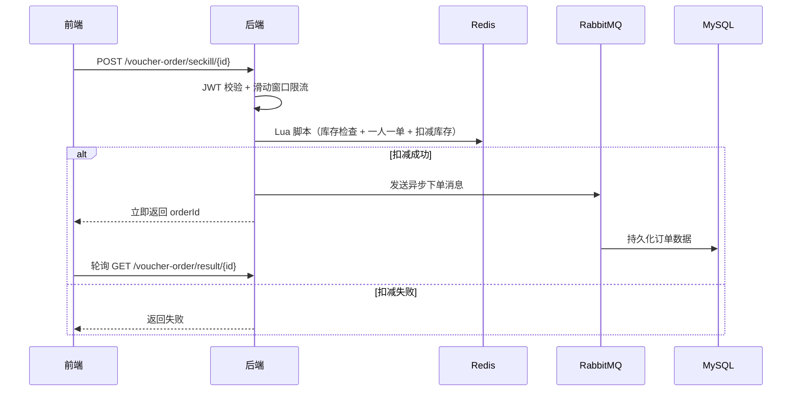

# 知味 - 本地生活服务点评平台

## 📖 项目概述
> 一个基于 Spring Boot + Redis + MySQL 的实战项目，类似大众点评的基础功能实现。

[](https://opensource.org/licenses/MIT)

## 📑 目录
- [技术栈](#-技术栈)
- [功能亮点](#-功能亮点)
- [秒杀系统架构](#-秒杀系统架构)
- [项目结构](#-项目结构)
- [快速开始](#-快速开始)
- [主要接口](#-主要接口)
- [API 文档](#-api-文档)
- [更新日志](#-更新日志)
- [已完成升级](#-已完成升级)
- [未来规划](#-未来规划)

## 🛠 技术栈

| 类别 | 技术 | 说明 |
|------|------|------|
| 后端框架 | Spring Boot 2.3.12 | 核心业务逻辑 |
| ORM | MyBatis Plus | 数据库操作 |
| 数据库 | MySQL 8.0 | 持久化存储 |
| 缓存 | Redis 7.0+ | GEO 位置搜索、HyperLogLog UV 统计、Lua 库存扣减 |
| 消息队列 | RabbitMQ | 秒杀异步下单、死信队列补偿、私信消息持久化 |
| 前端 | Vue.js + Element UI + Axios | 单页面应用 |
| Web 服务器 | Nginx 1.18.0 | 前端部署、反向代理 |
| 认证 | JWT + 拦截器 | 登录校验、ThreadLocal 线程隔离 |
| 构建工具 | Maven + Docker | 依赖管理与打包、Compose 一键部署 |

## ✨ 功能亮点

- **附近商户搜索**：基于 Redis GEO 数据类型实现按距离排序与滚动分页。
- **优惠券秒杀**：Redis + Lua 脚本原子扣减库存 + RabbitMQ 异步下单 + 死信队列补偿，避免超卖与瞬时峰值。
- **用户认证**：JWT 令牌 + 拦截器校验，通过 ThreadLocal 传递用户上下文。
- **UV 统计**：利用 Redis HyperLogLog 估算独立访客量，内存占用极小。
- **博客社区**：支持发布图文、点赞、评论、关注取关、共同关注、Feed 流推送。
- **私信聊天**：支持一对一实时私信，未读红点提醒，全部已读。
- **个人主页**：粉丝/关注列表、签到打卡、昵称头像编辑、个人资料修改。

## 🏗 秒杀系统架构



## 📁 项目结构

```
hmdp/ 
├── hm-dianping/                          # Spring Boot 后端
│   ├── src/main/java/com/hmdp/ 
│   │   ├── config/                       # 配置类（MVC、Redis、RabbitMQ、Knife4j）
│   │   ├── controller/                   # 接口层（12 个 Controller）
│   │   ├── service/                      # 业务逻辑层
│   │   │   └── impl/                     # 服务实现
│   │   ├── mapper/                       # MyBatis 数据访问层
│   │   ├── entity/                       # 实体类
│   │   ├── dto/                          # 数据传输对象
│   │   └── utils/                        # 工具类（JWT、Redis、雪花ID、MQ消费者等）
│   ├── src/main/resources/ 
│   │   ├── application.yaml              # 主配置
│   │   ├── seckill.lua                   # Lua 秒杀脚本（库存扣减 + 一人一单）
│   │   ├── rate_limit.lua                # Lua 滑动窗口限流脚本
│   │   └── unLock.lua                    # Lua 分布式锁释放脚本
│   ├── pom.xml 
│   └── Dockerfile 
├── nginx-1.18.0/                         # Nginx + 前端静态文件
│   ├── conf/nginx.conf                   # 反向代理配置
│   └── html/hmdp/                        # 前端页面
│       ├── index.html                    # 首页
│       ├── shop-list.html                # 商铺列表
│       ├── shop-detail.html              # 商铺详情
│       ├── blog-detail.html              # 博客详情
│       ├── blog-edit.html                # 发布博客
│       ├── info.html                     # 个人主页
│       ├── info-edit.html                # 编辑资料
│       ├── other-info.html               # 他人主页
│       ├── chat.html                     # 私信聊天
│       ├── message.html                  # 消息列表
│       ├── login.html                    # 登录页
│       ├── css/                          # 样式
│       ├── js/                           # 脚本（Vue、Axios、Element UI）
│       └── imgs/                         # 图片资源
├── hmdp.sql                              # 数据库初始化脚本
├── docker-compose.yml                    # Docker Compose 一键部署
└── README.md
```

## 🚀 快速开始

### 环境准备

| 组件 | 版本 | 说明 |
|------|------|------|
| JDK | 17+ | 后端运行环境 |
| MySQL | 8.0+ | 持久化存储 |
| Redis | 7.0+ | 缓存与分布式操作 |
| RabbitMQ | 3.8+ | 消息队列（仅测试博客/评论等功能时可省略） |
| Nginx | 1.18.0+ | 前端部署与反向代理 |
| Maven | 3.6+ | 项目构建 |
| Docker & Compose | — | 可选，推荐使用 |

### 方式一：Docker Compose（推荐）

```bash
# 克隆项目
git clone https://github.com/orange-orunji/hmdp.git
cd hmdp

# 启动所有服务（MySQL、Redis、后端、Nginx）
docker-compose up -d

# 初始化数据库（首次执行，替换 your_password 为实际密码）
docker exec -i mysql-container mysql -uroot -p'your_password' < hmdp.sql

# 浏览器访问 http://localhost
```

### 方式二：本地运行

1. **初始化数据库**
   ```bash
   mysql -u root -p < hmdp.sql
   ```

2. **修改配置**  
   编辑 `hm-dianping/src/main/resources/application.yaml`，填写你的 MySQL 和 Redis 连接信息。

3. **启动后端**
   ```bash
   cd hm-dianping
   mvn spring-boot:run
   ```

4. **配置 Nginx**  
   将前端文件放入 Nginx 的 `html/hmdp/` 目录，添加反向代理配置：
   ```nginx
   location /api {
       proxy_pass http://localhost:8081;
   }
   ```

5. **访问**  
   浏览器打开 `http://localhost` 即可看到前端页面。

## 📊 主要接口

| 模块 | 接口示例 | 说明 |
|------|----------|------|
| 店铺 | `GET /shop/1` | 查询店铺详情 |
| 附近搜索 | `GET /shop/of/type?typeId=1&current=1&x=39.9&y=116.4` | 按距离查询周边店铺 |
| 秒杀 | `POST /voucher-order/seckill/1` | 优惠券秒杀 |
| 登录 | `POST /user/login` | 手机号验证码登录 |
| 博客 | `GET /blog/hot?current=1` | 热门博客列表 |
| 评论 | `POST /blog-comments` | 发表博客评论 |
| 私信 | `POST /message` | 发送私信 |
| 会话 | `GET /message/conversations` | 私信会话列表（含未读数） |
| 聊天 | `GET /message/chat/{userId}` | 查询与某用户的聊天记录 |
| 已读 | `PUT /message/read-all` | 全部私信标为已读 |
| 关注 | `PUT /follow/{id}/{isFollow}` | 关注/取关 |
| 签到 | `POST /user/sign` | 每日签到 |
| 资料 | `PUT /user/me` | 修改昵称头像 |

## 📖 API 文档

项目已集成 Knife4j，启动后端后访问：

```
http://localhost:8081/doc.html
```

## 📝 更新日志

- **2026-06-23**：新增私信聊天系统（实时私信、未读红点、全部已读）
- **2026-06-23**：完善博客评论系统（发表评论、评论列表展示）
- **2026-06-23**：完善个人主页（粉丝/关注列表、昵称头像编辑、个人资料修改）
- **2026-06-21**：RabbitMQ 消息队列完善秒杀（MQ 异步下单、死信队列、轮询查询接口）
- **2026-06-19**：Docker 一键部署
- **2026-06-17**：部署到 Linux 服务器、初始化 README
- **2026-05-20**：新增 Redis HyperLogLog UV 统计与 GEO 附近店铺滚动查询
- **2026-05-19**：开发共同关注功能
- **2026-05-14**：上传核心业务代码
- **2026-05-09**：项目初始化，提交数据库脚本

## ✅ 已完成升级

从最初的 Demo 级项目，已完成的架构升级：

- **消息队列异步化**：接入 RabbitMQ，将秒杀下单异步化，配合死信队列实现重试机制，平滑峰值流量。
- **分布式锁**：使用 Lua 脚本原子操作替代 Redisson，确保一人一单、库存扣减等临界操作的线程安全。
- **压测与 JVM 调优**：通过 JMeter 全链路压测，借助 Arthas 分析热点代码，最终输出 QPS 3000+ 的性能报告。

## 🔮 未来规划

计划进一步升级为高并发深度版，主要改造方向包括：

1. **Canal 数据同步**  
   监听 MySQL binlog，实时更新 Redis 缓存与 Elasticsearch 索引，解决缓存一致性难题。

2. **多级缓存**  
   引入 Caffeine 本地缓存 + Redis 分布式缓存，配合逻辑过期与布隆过滤器，大幅提升查询性能。

3. **高性能搜索**  
   搭建 Elasticsearch 集群，支持全文检索、地理位置排序、搜索建议等高级功能。

4. **读写分离与分表**  
   利用 ShardingSphere 实现数据库读写分离、订单分表，应对海量数据存储需求。

---

## 👤 贡献者

- [orange-orunji](https://github.com/orange-orunji)

## 📄 许可证

本项目基于 [MIT License](LICENSE) 开源，修改及分发时请保留原始版权声明。
